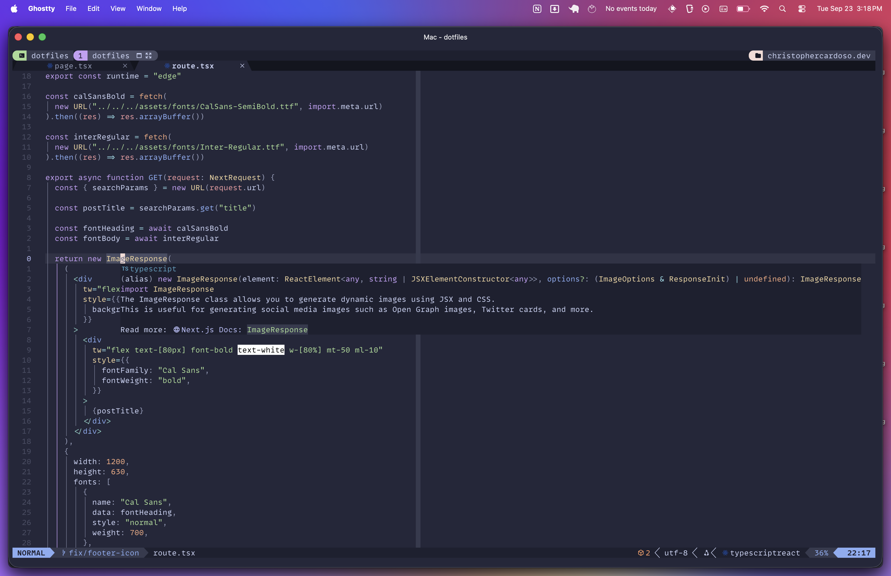
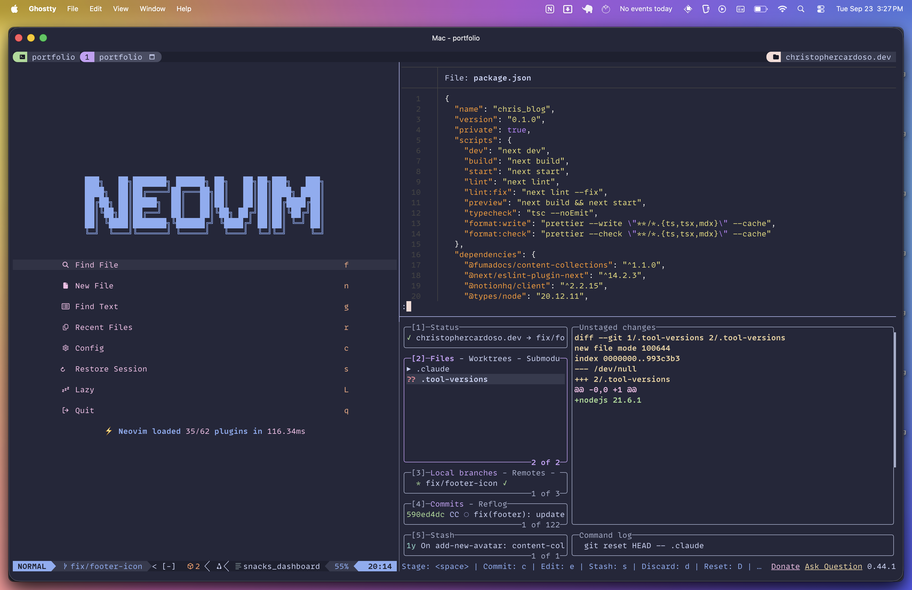

# Dotfiles

This is my dotfiles configuration featuring modern tools, consistent theming (Catppuccin Macchiato), and some intuitive CLI commands.


_Neovim_


_Tmux session with Tmuxinator_

## Highlights

- **One-command setup** with a simple CLI named **dotfiles**
- **Lightning-fast startup** (always improving)
- **Catppuccin theming** across all applications
- **Some CLI tools I'm using** (eza, bat, fd, ripgrep, zoxide)

## Quick Start

```bash
# Clone and setup everything
git clone https://github.com/kriscard/.dotfiles.git ~/.dotfiles
cd ~/.dotfiles
./dotfiles init
```

## CLI Commands

| Command             | Purpose                    |
| ------------------- | -------------------------- |
| `dotfiles init`     | Complete system setup      |
| `dotfiles doctor`   | Health check & diagnostics |
| `dotfiles sync`     | Sync configurations only   |
| `dotfiles backup`   | Backup existing configs    |
| `dotfiles ds_store` | Clean .DS_Store files      |

**Options:** `--dry-run` `--force` `--verbose`

```bash
# Examples
dotfiles doctor --verbose     # Detailed diagnostics
dotfiles sync --dry-run      # Preview changes
dotfiles backup              # Safe backup
```

## Key Features

### Core Tools

- **Neovim**: Lua config mostly for Frontend/Full-Stack developer LSP
- **Tmux**: Session management with vim keybindings
- **Terminal**: Kitty/Ghostty with Catppuccin Macchiato theme
- **Shell**: Zsh

### Modern CLI Tools

| Traditional | Replacement | Benefit                 |
| ----------- | ----------- | ----------------------- |
| `ls`   | `eza`        | Git integration & icons |
| `cat`  | `bat`        | Syntax highlighting     |
| `find` | `fd`         | Faster & simpler        |
| `grep` | `ripgrep`    | Blazing fast search     |
| `cd`   | `zoxide`     | Smart jumping           |

### Development Shortcuts

```bash
# Quick navigation
z project-name        # Jump to project (zoxide)
gcm "message"         # Git add + commit
killport 3000         # Kill process on port

# Tmux sessions
<prefix> + e          # Session launcher with Tmux SessionX
<prefix> + Ctrl-s     # Save session
```

## Theming

Consistent Catppuccin theme across all tools:

```bash
export THEME_FLAVOUR=macchiato  # frappe, latte, mocha
```

## License

This project is licensed under the MIT License - see the [LICENSE](LICENSE) file for details.
