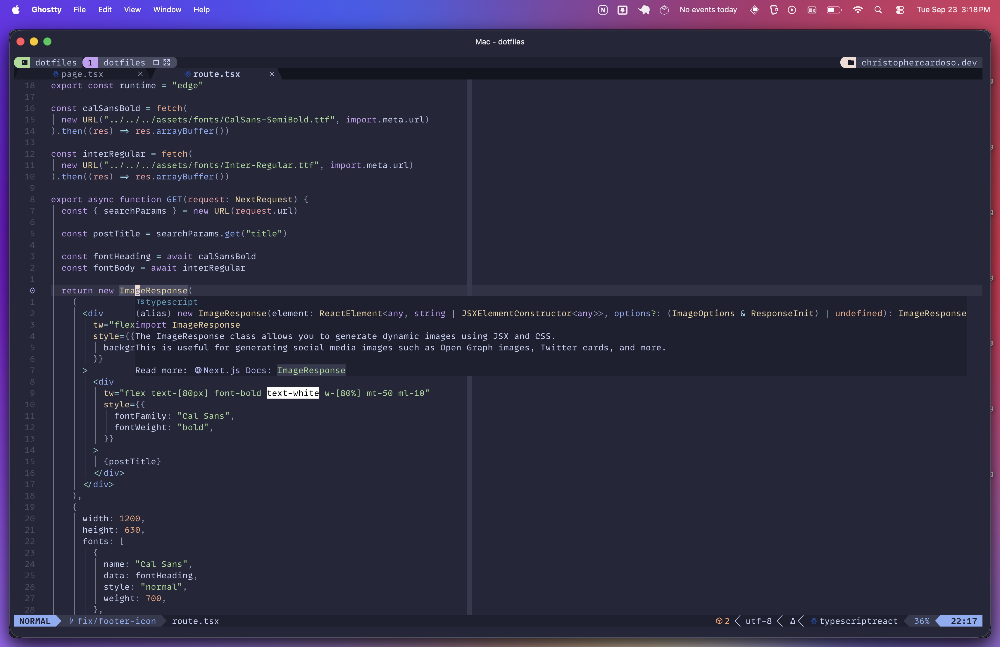
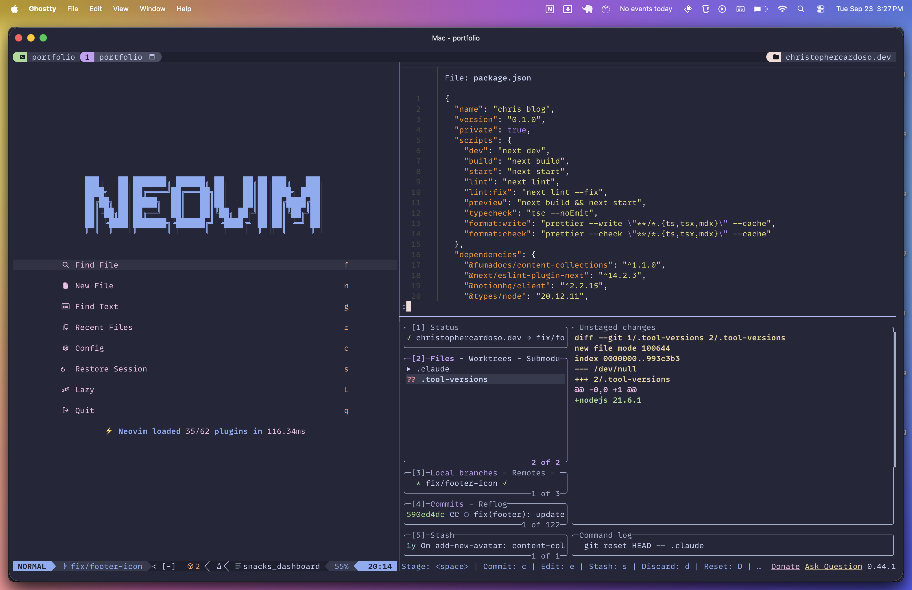

# Dotfiles

Modern development environment with one-command setup, Catppuccin Macchiato theming, and enhanced CLI tools.




## Requirements

Neovim ≥ 0.12 (uses `vim.lsp.config` and treesitter `main` branch). `tree-sitter-cli` is installed automatically via Brewfile to compile parsers locally.

## Quick Start

```bash
# Clone and setup everything
git clone https://github.com/kriscard/.dotfiles.git ~/.dotfiles
cd ~/.dotfiles
./dotfiles init
```

## CLI Commands

| Command             | Purpose                       |
| ------------------- | ----------------------------- |
| `dotfiles init`     | Complete system setup         |
| `dotfiles update`   | Update dotfiles + packages    |
| `dotfiles packages` | Install Brewfile packages     |
| `dotfiles sync`     | Sync config symlinks (Stow)   |
| `dotfiles doctor`   | Health check & diagnostics    |
| `dotfiles backup`   | Backup existing configs       |
| `dotfiles restore`  | Restore from backup           |
| `dotfiles macos`    | Apply macOS defaults          |
| `dotfiles ds_store` | Clean .DS_Store files         |

**Options:** `--dry-run` `--force` `--verbose`

```bash
# Examples
dotfiles doctor --verbose     # Detailed diagnostics
dotfiles sync --dry-run      # Preview changes
dotfiles backup              # Safe backup
```

## What's Included

### Core Tools

- **Neovim**: Lua config mostly for Frontend/Full-Stack developer LSP
- **Tmux**: Session management with vim keybindings
- **Terminal**: Kitty/Ghostty with Catppuccin Macchiato theme
- **Shell**: Zsh

### Modern CLI Tools

| Traditional | Replacement | Benefit                 |
| ----------- | ----------- | ----------------------- |
| `ls`        | `eza`       | Git integration & icons |
| `cat`       | `bat`       | Syntax highlighting     |
| `find`      | `fd`        | Faster & simpler        |
| `grep`      | `ripgrep`   | Blazing fast search     |
| `cd`        | `zoxide`    | Smart jumping           |

### Development Shortcuts

```bash
# Quick navigation
z project-name        # Jump to project (zoxide)
gcm "message"         # Git add + commit
killport 3000         # Kill process on port

# Tmux sessions
<prefix> + e          # Session launcher with Sesh Tmux Session Manager
<prefix> + Ctrl-s     # Save session
```

### Theming

Consistent Catppuccin Macchiato theme across all tools:

```bash
export THEME_FLAVOUR=macchiato  # frappe, latte, mocha
```

## License

This project is licensed under the MIT License - see the [LICENSE](LICENSE) file for details.
